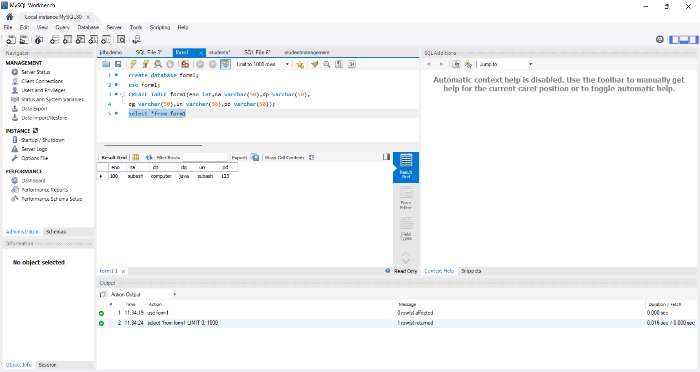
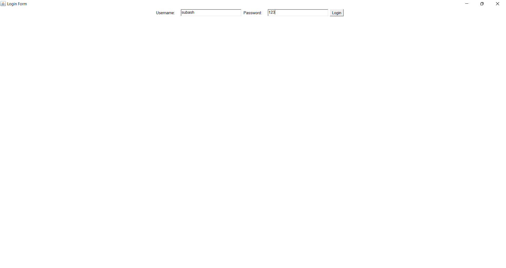

# Project: Student Form Submission System(Login)
    * A Java-based student login form submission system using "Remote Invocation Method" and "MySQL"

# Features
    * Remote database connectivity with MySQL
    * check student login detail with already registered data using RMI
    * GUI implementation with AWT for user interaction

# Technologies used
    * JAVA
    * RMI
    * MySQL
    * AWT

 # Screenshots
1.Registered Data:
2.Login:

# Future Enhancements
    * Implement user authentication
    * Add email notifications for login success

# Author 
    Subash.S.K
